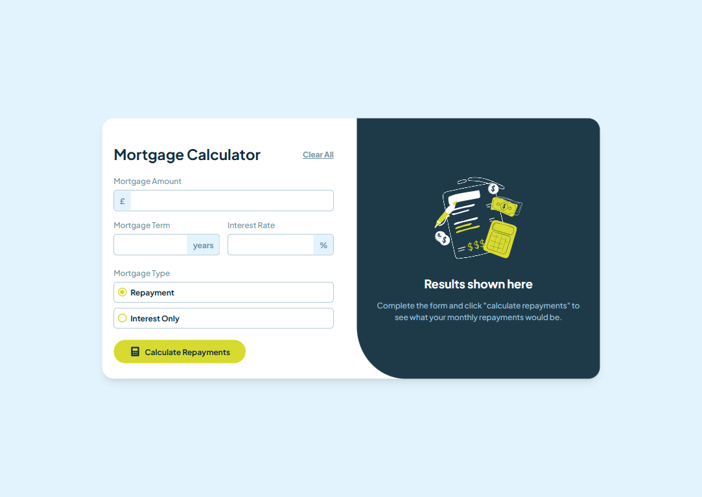
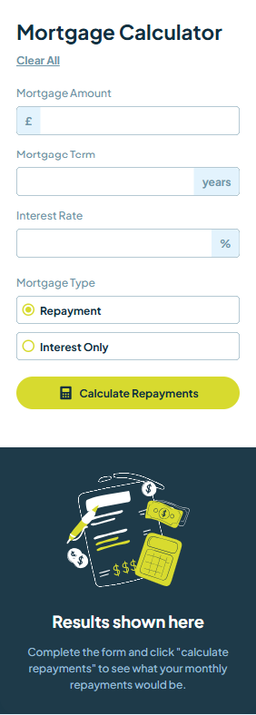

# Frontend Mentor - Mortgage repayment calculator solution

This is a solution to the [Mortgage repayment calculator challenge on Frontend Mentor](https://www.frontendmentor.io/challenges/mortgage-repayment-calculator-Galx1LXK73). Frontend Mentor challenges help you improve your coding skills by building realistic projects. 

## Table of contents

- [Overview](#overview)
  - [The challenge](#the-challenge)
  - [Screenshot](#screenshot)
  - [Links](#links)
- [My process](#my-process)
  - [Built with](#built-with)
  - [What I learned](#what-i-learned)
  - [Continued development](#continued-development)
  - [Useful resources](#useful-resources)
- [Author](#author)
- [Acknowledgments](#acknowledgments)

## Overview

### The challenge

Users should be able to:

- Input mortgage information and see monthly repayment and total repayment amounts after submitting the form
- See form validation messages if any field is incomplete
- Complete the form only using their keyboard
- View the optimal layout for the interface depending on their device's screen size
- See hover and focus states for all interactive elements on the page

### Screenshot

### Links

- Solution URL: [Github Repo](https://github.com/stephany247/mortgage-repayment-calculator)
- Live Site URL: [Live Demo](https://mortgage-repayment-calculator-wine.vercel.app/)

## My process

### Built with

- Semantic HTML5 markup
- CSS custom properties
- Flexbox
- CSS Grid
- Mobile-first workflow
- [React](https://reactjs.org/) - JS library
- [Tailwind CSS](https://tailwindcss.com/docs/installation) - For styles

### What I learned

I improved my handling of input styling and functionality while also gaining a better understanding of CSS Grid and Flexbox for layout structuring. I learned to use semantic HTML for better accessibility and applied React state management to update inputs and results dynamically.

### Continued development

In future projects, I want to improve my range input styling and accessibility. I also aim to refine my CSS Grid and Flexbox skills for better responsiveness. Additionally, I plan to learn TypeScript to write better-structured and maintainable code.

### Useful resources

- [React Documentation](https://reactjs.org/docs/getting-started.html) - Official React documentation.
- [Tailwind CSS Documentation](https://tailwindcss.com/docs) - Official Tailwind CSS documentation.
- [MDN Web Docs](https://developer.mozilla.org/en-US/) - Comprehensive resource for web development documentation.

## Author

- Website - [Onyinye Stephanie Oguocha](https://www.your-site.com)
- Frontend Mentor - [stephany247](https://www.frontendmentor.io/profile/stephany247)
- Twitter - [@stephanyoguocha](https://x.com/stephanyoguocha)

## Acknowledgments

I would like to thank the following resources and individuals for their support and inspiration:

- [Frontend Mentor](https://www.frontendmentor.io) - For providing the project challenge.
- [React](https://reactjs.org) - For the amazing library.
- [Tailwind CSS](https://tailwindcss.com) - For the utility-first CSS framework.
